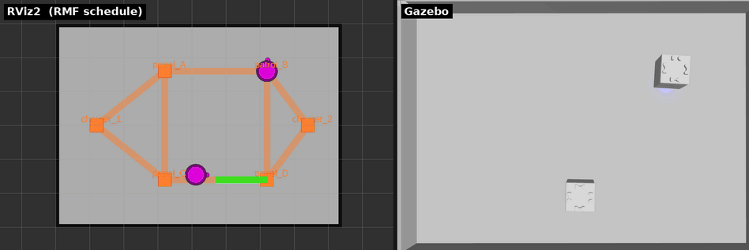

# 章9: フリートアクション(perform_action)

← [前章: 搬送とワークセル](08_delivery.md) | [目次](README.md) | 次章: [可視化とダッシュボード →](10_visualization.md)

## 狙い

- フリートが独自に宣言する**カスタム動作**(フリートアクション)を単独で実行する
- 前章の delivery が「ワークセル任せで**キューブは演技しない**」だったのに対し、
  こちらは**キューブ自身にLEDと効果音で動作を表現させる**方法
- フリート設定(YAML)を編集して、ロボットの振る舞いを変える体験をする

パッチ不要でキューブの見せ方を試せる章。フリートを「カスタマイズする」入口。

## フリートアクションとは

RMFには、標準タスク(patrol / delivery / charge)では表せない**フリート独自の
動作**を宣言する仕組みがある。フリートアダプタが「うちのロボットは○○が
できます」と申告し、`perform_action` タスクでそれを名指しで実行する。

toioフリートが宣言しているのは2つ:

- `delivery_pickup` … pickup動作の演出
- `delivery_dropoff` … dropoff動作の演出

キューブには搬送機構が無いので、形だけの実装になっている。**その場で3秒
保持し、LED(pickup=緑 / dropoff=青)と効果音で「何をしているか」を見せる**
だけだ。delivery(章8)がワークセル側で完結してキューブが無反応なのに対し、
これは**キューブ側の演出**にあたる。

## 動かす

指定した頂点へ移動し、そこでフリートアクションを実行する:

```bash
ros2 run rmf_demos_tasks dispatch_action -s patrol_A -a delivery_pickup --use_sim_time
```

| 引数 | 意味 |
|---|---|
| `-s` | アクションを実行する waypoint 名 |
| `-a` | アクション名(`delivery_pickup` / `delivery_dropoff`) |

dropoff側も試す:

```bash
ros2 run rmf_demos_tasks dispatch_action -s patrol_D -a delivery_dropoff --use_sim_time
```

## 観察する


*指定頂点へ移動して `perform_action` を実行する様子。右の Gazebo で、pickup 時に
キューブの LED が**緑**、dropoff 時に**青**へ色づくのが見える(その間 3 秒保持)。
左の RViz2 では各ロボットが対象 waypoint 上で停止する。*

- ロボットが指定頂点へ移動し、そこで**3秒保持**する
- **LEDが色づく**(pickup=緑 / dropoff=青)。toio_gazebo の `ToioLedSystem` が
  フリートアダプタの LED 指令を反映するため、上のGIFのとおり**シミュレーションでも
  色は見える**。効果音は `toio_sound` ノードが効果音ID付きで指令を出す(ログに
  `playing sound effect ...` が出る)が、**sim では鳴らない**。実機ではこの効果音が
  実際に鳴る ── この差が章11で実機に移る動機のひとつ。
- `rmf_task_dispatcher` のログで、`perform_action` タスクがアクション名付きで
  実行される様子が読める

## カスタマイズする(YAML編集)

保持時間・色・効果音は、フリート設定
`toio_fleet_adapter/config/toio_fleet_config_<mat>.yaml` の `toio.actions`
セクションで変えられる。編集後は端末Aを起動し直すと反映される。

> `toio.actions` は `finishing_request`([章7](07_battery_charge.md))と同じく
> フリートアダプタ(RMF側)の設定。**実機では端末2(RMFコア+アダプタ)を
> 再起動するだけで反映され、端末1の実機ブリッジは触らなくてよい**
> (キューブは繋ぎっぱなしでよい)。

**やってみる**: `delivery_pickup` の保持時間を長くする、LEDの色を変える、
などを1つ試して、`dispatch_action` で挙動が変わることを確認する。
章7で `recharge_threshold` をいじったときと同じく、
**フリートの振る舞いは設定ファイルで決まっている**という感覚がここでも強まる。

> どのキー(保持秒・色・効果音)がどれに対応するかは、実ファイルの
> `toio.actions` を開いて確かめること。このチュートリアルはコマンド操作を
> 主眼にしているため、YAMLの全キーはファイル側に委ねる。

## 理解する

- **delivery(章8)と perform_action(本章)は「荷役の見せ方」が逆**。
  - delivery: 荷役は**ワークセルの仕事**。キューブは移動して待つだけ、演技なし。
  - perform_action: 荷役の**演出はキューブの仕事**。フリートが宣言した動作を
    キューブ自身が実行する。
  実運用では「本物の荷役(ワークセル)」と「ロボットの演出」を組み合わせる
  ことになるが、学習としてはこの2つを分けて理解しておくと混乱しない。
- **フリートアクションは拡張ポイント**。標準タスクで足りない動作を、フリート
  側で定義してRMFに載せられる。toioでは「LEDと音」という無害な例だが、実機
  ロボットなら「アームで掴む」「扉を開ける」などをここに実装する。
- 章7・本章で**設定ファイルを2回いじった**。フリートの人格(いつ充電するか、
  どう荷役を演出するか)は、コードでなくYAMLに書かれている。これはRMF
  運用の実務でもそのまま役立つ勘所。

perform_action / delivery の対比は [docs/TASKS.md の dispatch_action](https://github.com/atinfinity/toio_rmf_bringup/blob/main/docs/TASKS.md)
にも整理がある。

## 確認課題

1. `delivery_pickup` と `delivery_dropoff` を両方投げ、頂点での3秒保持を
   観察する(実機なら色と音の違いも)。
2. `toio_fleet_config_<mat>.yaml` の `toio.actions` を1箇所編集(例:保持
   時間を延ばす)し、端末Aを再起動して反映されることを確認する。
3. delivery(章8)と perform_action(本章)で、「荷役をするのは誰か」の
   違いを一文で説明する。

タスクの一通りを触ったら、次章はここまで散発的に使ってきた**可視化**を
まとめ、ブラウザから操作できるダッシュボードも立てる。

← [前章: 搬送とワークセル](08_delivery.md) | [目次](README.md) | 次章: [可視化とダッシュボード →](10_visualization.md)
