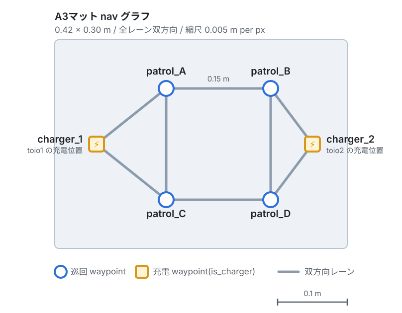
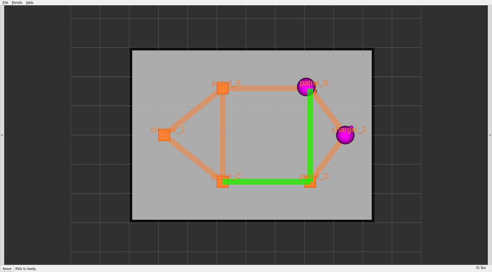
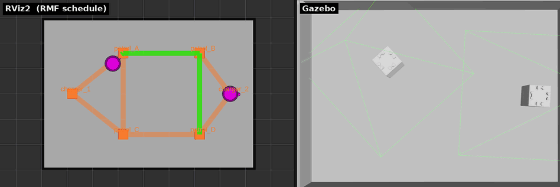

# 章4: 巡回と帰還(patrol)

← [前章: 1台を動かす](03_go_to_place.md) | [目次](index.md) | 次章: [2台と入札 →](05_bidding.md)

## 狙い

- 複数地点を周回する **patrol** タスクを投げる
- タスクで指定する `patrol_A` などが何なのか ── navグラフ(頂点とレーン)を理解する。ここはフリート処理の「地図」であり、章6の交通調停の舞台になる。
- タスク完了後に勝手にチャージャーへ帰る仕組み(`finishing_request`)を知る

## navグラフとは

RMFのロボットは自由空間を好きに動くのではなく、あらかじめ引かれた頂点(waypoint)とレーン(lane)の上を動く。この地図が **navグラフ**。タスクで指定する `patrol_A` はこの頂点名で、マットごとに定義が違う。

### A3マット(このチュートリアルの既定)

6頂点・8レーン、全レーン双方向。2台同時運用でも余裕がある。


*6頂点(`patrol_A`〜`patrol_D` と、両端の充電地点 `charger_1`=toio1 / `charger_2`=toio2)を双方向レーンで結んだ格子。タスクで指定する `patrol_A` などはこの頂点名。*

- `patrol_A–patrol_B–patrol_D` と `patrol_A–patrol_C–patrol_D` はどちらも 0.31mで等長。この事実は[章6](06_traffic.md)の交通調停で効いてくる ── 等長ゆえに、同じ2地点でも通るレーンが変わりうる。

> A4マットは形も向きも違う(一方通行ループ)。狭さゆえの設計で、[章6](06_traffic.md)と、実機編の[章12](12_real_go_to_place.md)で扱う。

## 動かす

`patrol_A` → `patrol_D` を3周させる:

```bash
ros2 run rmf_demos_tasks dispatch_patrol -p patrol_A patrol_D -n 3 --use_sim_time
```

| 引数 | 意味 |
|---|---|
| `-p` | 巡回先の頂点名。スペース区切りで複数、並べた順に訪問する |
| `-n` | 周回数(省略時1周) |
| `-st` | 開始までの遅延秒(省略時は即時) |

3地点以上も指定できる:

```bash
ros2 run rmf_demos_tasks dispatch_patrol -p patrol_A patrol_B patrol_D patrol_C -n 2 --use_sim_time
```

## 観察する

patrol実行中のRViz。緑の帯が `rmf_traffic_schedule` に予約された走行経路(スケジュール)で、稼働中のロボットにだけ出る。navグラフと床面図はそのまま残る。


*緑の帯が予約された経路。toio1が巡回中、toio2は `charger_2` で待機。(スケジュールのfootprint/vicinity 円は既定で非表示 ── [章10](10_visualization.md)参照)*


*同じ patrol 走行を2つのビューで並べたもの。左が RViz2(RMFスケジュール可視化 ── navグラフ・ロボット・予約経路)、右が toio_gazebo(マット上の実際のキューブの動き)。toio1が巡回先を順に訪問していく。*

### 1. 周回と帰還を目で追う

- 落札した1台が現在地から `patrol_A` へ向かい、`-p` の順に訪問することを `-n` 回繰り返す
- 全周回を終えると、自機のチャージャーへ帰還して充電待機に戻る(toio1なら `charger_1`)。これはフリート設定の `finishing_request: "charge"` による自動挙動 ── **タスクには「帰れ」と書いていないのに帰る**

### 2. 「経路は毎回RMFが選ぶ」を確かめる

同じ `patrol_A → patrol_D` でも、通るレーンは毎回RMFが計画し直す。上で見た等長経路が2本あるので、実行のたびに違う道を通ることがある。RVizで経路帯(schedule)を見ると、頂点の指定と実際の経路が別物だと分かる。混んでいる方を避けて別レーンを選ぶ余地がここにあり、章6の交通調停はそれを使う。

### 3. タスクの進捗を状態で読む

`/fleet_states` や `rmf_task_dispatcher` のログで、`TaskState` が `underway`(実行中)→ `completed`(完了)と遷移する。巡回先を1つ訪問するごとに進捗が刻まれる。

## 理解する

patrol は go_to_place(章3)の移動フェーズを、指定地点ぶん・指定周回ぶん並べたもの。navグラフはフリート全体で共有される地図なので、2台とも同じ頂点・レーンを使い、同じレーンを取り合う状況が起きる ── その調停は章6で扱う。

`finishing_request` は、タスクが終わったロボットをどうするか(charge / park / nothing)を決めるフリートの「片付け」ポリシーで、toio は `charge`(チャージャーへ帰す)。この帰還も1つのタスクとして navグラフ上を走るので、帰り道でも交通調停は効く。定義はフリート設定 `toio_fleet_config_<mat>.yaml` にあり、章7・章9で編集する。

## 確認課題

1. `patrol_B` → `patrol_C` の2地点patrolを何度か投げ、同じ指定でも通るレーンが変わりうることをRVizで確認する。「頂点を指定する」ことと「経路を決める」ことは別、と体感する。
2. patrol完了後、ロボットが自分のチャージャーに戻るのを確認する。 `charger_1` に戻るのはどちらのロボットか?(→ ロボットとチャージャーの対応は固定。章7の充電計画で再登場する)
3. 2台とも空いている状態でpatrolを1本だけ投げると、どちらが動くか。なぜその1台かを次章の入札で解明する。

navグラフという舞台が分かったら、次は2台を登場させて入札を見る。

← [前章: 1台を動かす](03_go_to_place.md) | [目次](index.md) | 次章: [2台と入札 →](05_bidding.md)
