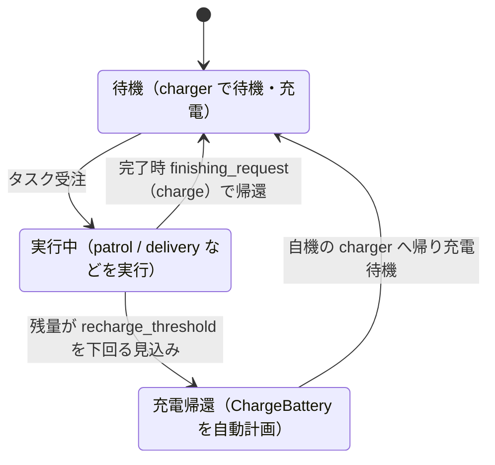

# 章7: バッテリと自動充電(ChargeBattery)

← [前章: 交通調停](06_traffic.md) | [目次](index.md) | 次章: [搬送とワークセル →](08_delivery.md)

## 狙い

- RMFがロボットのバッテリを見張り、尽きる前に勝手に充電へ帰す仕組みを知る
- 明示的に投げるタスクではない**ChargeBattery** が、どんな条件で自動計画されるかをフリート設定から理解する
- 実行中タスクをキャンセルする操作を覚える(充電・帰還と絡む)

入札(章5)・交通調停(章6)に続く、フリートの自己管理の層。

## ChargeBatteryは「投げない」タスク

これまでのタスク(go_to_place / patrol)はCLIから投げた。ChargeBatteryは違い、**RMFが「このままだとバッテリが足りない」と判断したときに自動で計画する**。運用者が忘れていても、ロボットが自分で充電に帰る ── これがフリートを長時間ほったらかせる理由。

判断はフリート設定 `toio_fleet_config_<mat>.yaml` の値で決まる:

| パラメータ | 値 | 意味 |
|---|---|---|
| `recharge_threshold` | `0.2` | 残量がこれを下回る見込みになると充電を計画 |
| `recharge_soc` | `1.0` | 充電の目標残量(満充電) |
| `account_for_battery_drain` | `true` | 見積もり時にバッテリ消費を織り込む |
| `finishing_request` | `"charge"` | タスク完了後もチャージャーへ帰す |

`account_for_battery_drain: true` が効いているので、RMFは入札の段階から「このタスクを最後までやったらバッテリはいくつになる?」を計算している。足りなくなる見込みなら、先に充電を挟む。

## 状態遷移で捉える



図の詳細版は[docs/TASKS.mdのChargeBattery](https://github.com/atinfinity/toio_rmf_bringup/blob/main/docs/TASKS.md)にある。

## 動かす・観察する

### 1. バッテリの現在値を見る

各ロボットの `battery_percent` は `/fleet_states` に入っている:

```bash
ros2 topic echo /fleet_states --once
```

> [!IMPORTANT]
> **シミュレーションではこの値は100%に固定**され、放電も充電もしない。toioのアダプタは実機の `/toioN/toio/battery_state` を残量の入力にしており、simにはそれが無いためだ。

フリート設定の `account_for_battery_drain` は、タスクの見積り(入札コスト)には効くが、報告される残量そのものは動かさない。実機ではこの値がキューブの実測(10%刻みの離散値)由来になり、25分のタスク走行で90% → 70%ほど減る。実機での確認は[章14](14_real_battery_charge.md)。

### 2. 既定のsimではChargeBatteryは発火しない ── `publish_battery` で見る

上の状態遷移の「実行中 → 充電帰還」は、残量が `recharge_threshold` を下回る見込みになると起きる。しかしsimでは残量が100%に張り付いたままなので、既定の起動ではChargeBatteryは発火しない(このリポジトリで実測確認)。patrolを30周させても `battery_percent` は100.0%のまま。`recharge_threshold` を0.9に上げ、`ambient_system.power` を100倍にしても結果は同じで、報告残量が動かない以上RMFは「下回る見込み」と判断できず、判断できなければ充電も挟まない。アダプタのログにも `The current battery percentage is 100.0% ... charging at an average rate of 0.0 %/hour` と出る。

実機ではキューブの `battery_state` が実際に放電するので、残量が20%以下に落ちるとChargeBatteryが発火する([toio_rmf_bringup#50](https://github.com/atinfinity/toio_rmf_bringup/issues/50))。手順は[章14](14_real_battery_charge.md)と[issue #35](https://github.com/atinfinity/toio_rmf_bringup/issues/35)にある。

> [!TIP]
> **simでもChargeBatteryを見たいときは、toio_gazeboのオプトインのsimバッテリを有効にする**(`publish_battery:=true`)。走行でSoC(State of Charge、残量)が減り、自機チャージャーで充電されるので、「残量低下 → ChargeBattery → チャージャーへ帰還 → 充電 → 復帰」を通しで観察できる。デモを短時間で見たいときは `battery_discharge_rate` を上げる:
>
> ```bash
> ros2 launch toio_rmf_bringup toio_rmf.launch.py mat:=a3 run_sim:=true \
>   use_sim_time:=true publish_battery:=true battery_discharge_rate:=0.02 \
>   battery_quantize_steps:=0
> ```
>
> 報告される残量は既定で10%刻み(実機のキューブに合わせている)。下のGIFのように滑らかなバーで見たいときは `battery_quantize_steps:=0` を付ける。仕組みと引数は[toio_gazeboの「Battery and Open-RMF ChargeBattery」](https://github.com/atinfinity/toio_gazebo/blob/main/docs/topics.md#battery-and-open-rmf-chargebattery)。


*`publish_battery:=true`(放電を速めた例)。patrol中に `battery_percent`(左下のバー)が減る。低下するとチャージャーへ帰り、CHARGINGで100%まで回復してからタスクに戻る。simで再現した充電まわりの一連。既定はOFFなので、付けなければ残量は100%固定のまま。*

### 3. 完了後の自動帰還を見る(finishing_request)

短いpatrolでも、完了後にチャージャーへ帰るのは `finishing_request: "charge"` の働き。章4で見た「勝手に帰る」挙動の正体がこれ。ChargeBatteryの「途中で帰る」と、finishing_requestの「終わったら帰る」は別トリガだが、どちらも「充電待機へ戻す」点で連続している。

## キャンセルと帰還

実行中のタスクは途中で取り消せる。取り消したロボットは `finishing_request` に従ってチャージャーへ戻る:

```bash
ros2 run rmf_demos_tasks cancel_task -id <task_id>
```

- `task_id` は投入時のCLI出力、または `rmf_task_dispatcher` のログに出る
- **`cancel_task` は `--use_sim_time` を受け付けない**(`-id` のみ)。このチュートリアルで唯一 `--use_sim_time` を付けないコマンド。
- `cancel_task` は実行後プロンプトに戻らず、止まったように見える。これは `rmf_demos_tasks` の仕様で、キャンセル要求をpublishした後にそのまま待受へ入るため。キャンセル自体は送信済みなので、`Ctrl-C` で抜けてよい。抜けたあとロボットがチャージャーへ戻れば成功。(詰まったら[TROUBLESHOOTING.md](TROUBLESHOOTING.md)も参照)

試すなら、長いpatrolを投げて途中で `cancel_task -id <task_id>` し、ロボットが巡回をやめてチャージャーへ帰るのを確認する。

## 理解する

- **バッテリ管理はフリートの自律性の要**。入札で「誰が」、交通調停で「どう道を分けるか」を見てきたが、ChargeBatteryはいつ休むかを自分で決める層。この3つが揃うと、運用者は個々のロボットの世話をしなくてよくなる。
- 見積もりにバッテリが入るので、章5の入札と繋がっている。残量の少ないロボットは「やったら足りなくなる」と見積もられ、入札で不利になったり、受注前に充電を挟んだりする。入札・充電・タスク実行は独立でなく連動している。
- finishing_requestとChargeBatteryは別物。前者は「タスク完了後の片付けポリシー」、後者は「実行中に残量が危ういときの割り込み」。混同しやすいが、トリガが違う。

## 確認課題

1. `/fleet_states` の `battery_percent` をechoし、長いpatrol中も100%から動かないことを確認する(simの制約。上のImportantの囲みの裏取り)。「なぜsimではChargeBatteryが発火しないか」を自分の言葉で説明できるか。
2. patrol完了後、ロボットが `finishing_request: "charge"` で自機のチャージャーへ帰るのを確認する(これはsimでも動く充電まわりの挙動)。`finishing_request` を `nothing` に変えて起動し直すと帰らなくなることも試す。確認後は `charge` に戻すこと ── `nothing` のままだと、以降の章の「完了後に帰還する」前提が崩れる。
3. 実行中タスクを `cancel_task` で取り消し、ロボットがチャージャーへ戻ることを確認する。キャンセルとfinishing_requestの関係を説明できるか。

自己管理まで見たら、次は「移動」以外のタスク ── 荷役(delivery)へ。ロボットだけでなくワークセルという別の登場人物が出てくる。

← [前章: 交通調停](06_traffic.md) | [目次](index.md) | 次章: [搬送とワークセル →](08_delivery.md)
