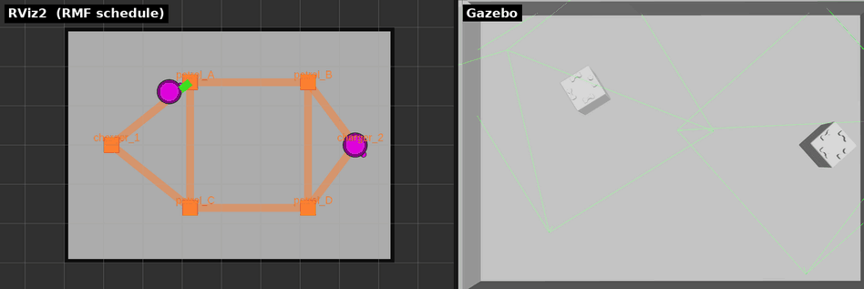

# 章8: 搬送とワークセル(delivery)

← [前章: バッテリと自動充電](07_battery_charge.md) | [目次](index.md) | 次章: [フリートアクション →](09_fleet_action.md)

## 狙い

- 「移動」だけでない**delivery**(荷物をpickup地点で受け取りdropoff地点で降ろす搬送)タスクを扱う
- RMFのdeliveryでは荷役をロボットではなくワークセル(dispenser / ingestor)が担う、という役割分担を理解する
- タスクが「フェーズの列」でできていることを、移動と荷役の組み合わせで見る

> [!NOTE]
> Ubuntu 24.04 + aptのOpen-RMF(本チュートリアルの前提環境)ではdeliveryはそのまま動く。macOS/RoboStackでソースビルドしたRMFでの既知問題は章末の補足を参照。

## ワークセルという登場人物

これまでロボットは自分で移動していた。deliveryでは「荷物を積む/降ろす」動作が要るが、**RMFではその荷役をロボットではなくワークセルという別ノードが担当する**:

- **dispenser**(払い出し機): pickup地点で荷物をロボットに載せる係
- **ingestor**(受け入れ機): dropoff地点で荷物を受け取る係

フリート(ロボット)の仕事はwaypoint間の移動だけ。着いたらワークセルに「荷役して」と要求を投げ、ワークセルが「完了」を返したら次へ進む。

toioのマットに実際に運べる物は無いので、`toio_rmf.launch.py` がmockワークセル(`toio_dispenser` / `toio_ingestor`)を起動する。要求に対して一定時間後に「完了」を返すだけで、実際には何も運ばない。これは[章2](02_architecture.md)で `ros2 node list` に出ていたノード。

## 動かす

pickupを `patrol_A`(処理はdispenser)、dropoffを `patrol_D`(処理はingestor)とする:

```bash
ros2 run rmf_demos_tasks dispatch_delivery -p patrol_A -ph toio_dispenser \
  -d patrol_D -dh toio_ingestor --use_sim_time
```

| 引数 | 意味 |
|---|---|
| `-p` / `-d` | pickup / dropoffのwaypoint名 |
| `-ph` / `-dh` | それを処理するワークセル名(この環境では `toio_dispenser` / `toio_ingestor` 固定) |
| `-pp` / `-dp` | 荷物の指定 `sku,数量`(省略可。mockは中身を見ない) |

## 観察する


*落札したロボットがpickup(`patrol_A`)→ dropoff(`patrol_D`)へ移動する様子を2つのビューで並べたもの。左がRViz2(RMFスケジュール可視化)、右がtoio_gazebo。各地点でワークセルの処理を待つ間、頂点上で停止して見える。*

タスクは移動→荷役→移動→荷役の順で進む:

1. ロボットが `patrol_A`(pickup)へ移動
2. `toio_dispenser` へ**DispenserRequest** を送る。ワークセルが既定3秒待って完了を返す間、ロボットは頂点上で停止して見える
3. `patrol_D`(dropoff)へ移動
4. `toio_ingestor` へ**IngestorRequest**、完了で `TaskState` が `completed`

ワークセルとのやりとりを覗くには:

```bash
ros2 topic echo /dispenser_requests   # 別端末で。pickup到達時に要求が飛ぶ
```

荷役の待ち時間は `mock_workcells.py --handle-seconds`(既定3秒)。詳しいシーケンス図は[docs/TASKS.mdのdeliveryタスク](https://github.com/atinfinity/toio_rmf_bringup/blob/main/docs/TASKS.md)にある。

**注意**: 標準のdeliveryではキューブのLED・効果音は出ない。pickup / dropoffはワークセル側で完結し、フリートのアクション(`delivery_pickup` / `delivery_dropoff`)は呼ばれない。キューブ側で「荷役してる感」を出したい場合は次章のperform_actionを使う。

## 理解する

deliveryでは、タスクが「移動フェーズ → 荷役フェーズ → 移動フェーズ → 荷役フェーズ」と積まれていて、フェーズの列という構造が最もはっきり見える。肝は役割分担で、ロボットは移動だけ、荷役は `DispenserRequest` / `IngestorRequest` という専用トピックでワークセルに頼む。つまり**フリートアダプタは移動をNav2へ、荷役をワークセルへ、と別々の相手に指示を出している**。この分離のおかげで、実際の倉庫では「アームを持つ払い出し機」「ベルトコンベアの受け入れ口」などロボットとは別のハードにワークセルを割り当てられる。

## 確認課題

1. deliveryを投げ、ロボットがpickup地点で約3秒停止してからdropoffへ向かうことを観察する。この停止がDispenserRequestの処理時間。
2. `/dispenser_requests` と `/ingestor_requests` をechoし、pickup到達時とdropoff到達時にそれぞれ要求が飛ぶことを確認する。「移動」と「荷役」で指示の宛先が違うことを見る。
3. 同じpickup/dropoffをgo_to_place 2本(`patrol_A` へ行って、`patrol_D` へ行く)で代用したときと比べ、deliveryが余分に何をしているか(つまり荷役フェーズ)を言葉にする。

## 補足: 環境による既知問題(Ubuntuでは無関係)

Ubuntu 24.04 + aptのOpen-RMFではdeliveryはそのまま動く。このリポジトリでの実測(toio_gazebo, A3)では、入札 → 落札 → `patrol_A`(dispenserでpickup)→ `patrol_D`(ingestorでdropoff)→ チャージャー帰還まで、fleet_adapterがクラッシュせず完走した。

一方、macOS/RoboStackでソースビルドしたRMFには既知の問題がある([#20](https://github.com/atinfinity/toio_rmf_bringup/issues/20))。delivery開始時にfleet_adapterが異常終了するもので、原因は `rmf_task_sequence` が扱う `std::optional<nlohmann::json>` のABI不整合 ── ライブラリ間でnlohmannのコンパイル定義(`JSON_DIAGNOSTICS` 等)が食い違っている。一貫ビルドされたapt debでは再現しない。

← [前章: バッテリと自動充電](07_battery_charge.md) | [目次](index.md) | 次章: [フリートアクション →](09_fleet_action.md)
