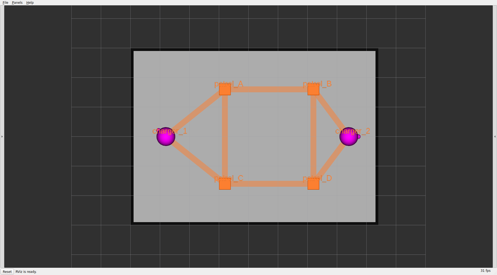
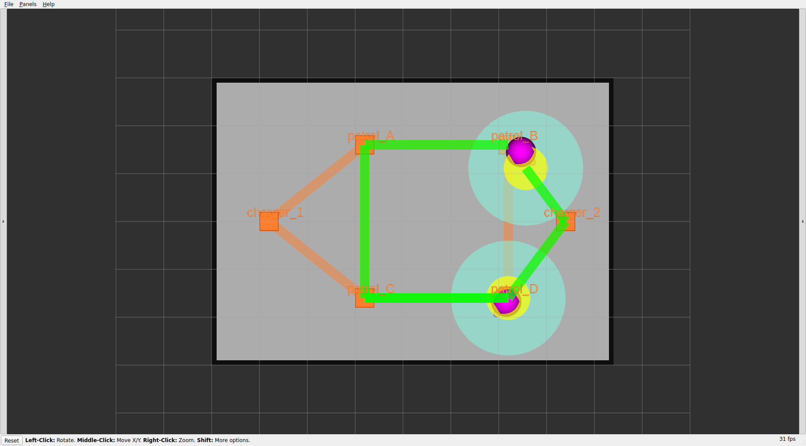

# 章10: 可視化とダッシュボード

← [前章: フリートアクション](09_fleet_action.md) | [目次](index.md) | 次章: [第2部 実機へ →](11_real_robot.md)

## 狙い

- ここまで断片的に使ってきたRVizの見方を整理する(何がどの層の情報か)
- ブラウザからタスク投入・監視ができるrmf-webダッシュボードを立てる(任意 ── CLIとRVizだけでも運用できる)
- sim編の総仕上げとして、「投入 → 走行 → 完了」をGUIで一望する

## RVizで何が見えているか ── マーカーの読み方

`toio_rmf.launch.py` は既定でRVizを起動する。真上から見た絵には複数の図形が重なっている。それぞれ別のトピックから来る「フリート処理の内部状態」で、担当ノードも異なる。

### 待機中(idle)の絵


*待機中 ── navグラフ(オレンジ)と2台のロボット(マゼンタ)がチャージャー上にいる。*

| 見た目 | 名前 | 意味 | 出どころ(トピック) |
|---|---|---|---|
| **マゼンタ(紫)の球** | ロボット本体 | フリートが自己申告する各ロボットの現在位置。1台に1つ | `/fleet_markers`(`body`)。半径は `toio_radius`=0.016m |
| 球から出る小さな突起 | 機首(nose) | ロボットの向き | `/fleet_markers`(`nose`) |
| ロボット名の文字(既定で非表示) | 名前ラベル(name) | 各ロボットの名前。`rviz/toio_rmf.rviz` がnamespace `name` をオフにしている。見たい場合はFleetMarkersの `name` にチェックを入れる | `/fleet_markers`(`name`) |
| **オレンジの正方形** | waypoint(頂点) | navグラフの停留点。タスクで指定する `patrol_A` 等の正体 | `/map_markers`(`toio/waypoints`) |
| **オレンジの半透明の帯**(格子) | lane(レーン) | 頂点間の通行可能経路。双方向格子 | `/map_markers`(`toio/lanes`) |
| オレンジの文字 | ラベル | waypoint名 | `/map_markers`(`toio/labels`) |
| **グレーの矩形(黒枠)** | 床面図(floorplan) | マットの外形 | `/floorplan`(building_map_server) |
| 細いグレーの方眼 | Grid | RVizの目盛り(5cm刻み)。マーカーではない | RViz内蔵 |

navグラフ(オレンジ)はRMFの「地図」([章4](04_patrol.md))を表し、マゼンタの球はフリートの「自己申告」([章2](02_architecture.md))を表す。

### 走行中の絵 ── 稼働中のマーカーが増える


*走行中 ── 緑の帯がスケジュール(予約経路)、稼働ロボットにtealと黄の円が付く。*

| 見た目 | 名前 | 意味 | 出どころ(トピック) |
|---|---|---|---|
| **緑の帯** | スケジュール(schedule) | `rmf_traffic_schedule` が予約した将来の走行経路。稼働中のロボットにだけ出る。2台が競合するとここで譲り合いが見える([章6](06_traffic.md)) | `/schedule_markers`(ns `participant N`) |
| **teal/黄の円**(vicinity / footprint) | 予約軌道上の周辺域・占有域 | 既定では非表示(下記)。スケジュールが予約した軌道上の位置に描かれる ── vicinityは他機への「近づくな」領域、footprintは占有面積を指す | `/schedule_markers`(ns `participant location N`) |

つまり色で層が分かれている ── **オレンジは地図(静的)、マゼンタはロボットの実位置、緑はいま走っているロボットの予約経路(動的)を示す**。

### なぜfootprint/vicinityを既定で隠しているか

teal/黄の円はスケジュール(予約)軌道上の位置に描かれ、ロボット本体(マゼンタ)の現在位置とは別物。ロボットは方向転換のたびに一瞬止まるため(Nav2のRPPコントローラ(Regulated Pure Pursuit)の `use_rotate_to_heading`)、予約軌道に対して遅れたり追いついたりを繰り返す。その差でteal/黄の円が前後に跳ねて見える(ロボット自体の動きは滑らかで、実測でも確認済み)。混乱を避けるため `rviz/toio_rmf.rviz` の `ScheduleMarkers` でnamespace `participant location *` を `false` にして**既定で非表示**にしている。緑の予約経路帯(`participant *`)は残している。

再表示したい場合は、RVizの `ScheduleMarkers` 表示を開き `participant location 0/1` のチェックを入れる(または当該namespaceを `true` にする)。有効化すると、稼働中のロボットの周囲にteal(vicinity)と黄(footprint)の円が現れる:


*参考:`participant location` を表示した状態。2台のロボットにtealのvicinityと黄のfootprintの円が描かれる(既定ではこれらを非表示にしている。本チュートリアルの他のスクリーンショット・動画は既定で非表示にした状態で撮影している)。*

footprint / vicinityを表示した場合、[章0](00_setup.md)のパッチを当てていない環境では、これらが高さ1m級の巨大な円柱になってnavグラフを覆い隠す。toioのマットは数cm〜数十cmで、RMFの可視化は数十m級の建物向けに作られているためだ。パッチの背景は[docs/SETUP.md](https://github.com/atinfinity/toio_rmf_bringup/blob/main/docs/SETUP.md)に詳しい。

ここで[章6](06_traffic.md)の2台交差タスクをもう一度投げてみるとよい。RVizで経路帯が2本引かれ、競合区間で片方が待つ/迂回する様子が見える。CLIログで読んでいた交通調停が、絵として一望できる。

## rmf-webダッシュボード(任意)

ブラウザからタスクを投げ、フリートを監視するGUI。ROS 2スタックはホストでそのまま動かし、rmf-webだけをコンテナ化する構成。使わなくても本パッケージの動作には影響しないので、GUIを試したい人向け。

構築とトラブルシュートの全ては[docs/DASHBOARD.md](https://github.com/atinfinity/toio_rmf_bringup/blob/main/docs/DASHBOARD.md)にあるので、ここでは最短の流れだけ示す。

### 1. ダッシュボードイメージをビルド(初回のみ)

```bash
cd ~/dev_ws/src/toio_rmf_bringup/docker
docker compose build dashboard
```

### 2. コンテナ起動(シミュレーションなのでUSE_SIM_TIME=true)

```bash
USE_SIM_TIME=true docker compose up -d
docker compose logs -f api-server   # 起動確認
```

### 3. ROS 2スタックをserver_uri付きで起動

端末Aを、ダッシュボードのapi-serverに繋ぐ形で起動し直す:

```bash
ros2 launch toio_rmf_bringup toio_rmf.launch.py \
  mat:=a3 run_sim:=true use_sim_time:=true \
  server_uri:=ws://localhost:8000/_internal
```

### 4. ブラウザで開く

<http://localhost:3000>

- **Map** タブ … マットと2台のキューブ
- **Robots** タブ … `toio1` / `toio2` がフリート `toio` として並び、位置とバッテリが更新される([章7](07_battery_charge.md)で見た値がGUIに出る)
- **Tasks** タブ … patrol / deliveryをフォームから投入できる


*Robotsタブ ── `toio1` / `toio2` がフリート `toio` として並び、Level=L1・Battery=100.00%・Status=CHARGINGを表示(api-serverが `server_uri` のWebSocket経由でフリート状態を受信している)。Batteryが100%固定なのは[章7](07_battery_charge.md)のとおりsimの制約。*

Tasksタブからpatrolを投入し、CLI(`dispatch_patrol`)で投げたときと同じタスクがGUIにも現れることを確認する。CLIとGUIは同じRMFコアに繋がっている ── 入口が違うだけ。

> ダッシュボードには既知の注意点(白画面・マーカーがマットを覆う・macOSでのネットワーク制約など)がいくつかある。詰まったら[docs/DASHBOARD.mdのトラブルシュート](https://github.com/atinfinity/toio_rmf_bringup/blob/main/docs/DASHBOARD.md)を先に見ること。

## 理解する

- **RVizは開発者の観察窓、ダッシュボードは運用者の操作卓**。RVizは内部状態(予約・TF・navグラフ)を細かく見るのに向き、rmf-webは「タスクを投げて結果を見る」運用に向く。目的で使い分ける。
- どちらもRMFコアの状態を映しているだけで、コアの動作を変えるものではない。GUIから投げたpatrolも、CLIから投げたpatrolも、入札→交通調停→充電という同じ処理を通る(章5〜7)。可視化は理解を助けるが、本質は下の層にある、という視点を保つ。

## 確認課題

1. RVizで2台交差タスクの経路帯を観察し、[章6](06_traffic.md)でログから読んだ「待ち・迂回」が絵として一致することを確認する。
2. (ダッシュボードを立てた人)Tasksタブからpatrolを投入し、Robotsタブでバッテリと位置が更新されるのを見る。CLI投入のタスクもTasks一覧に出るか。

これで第1部(シミュレーション編)は完走。第2部では、ここまで学んだことを実機のtoioキューブへ持っていく ── 何が変わり、何が変わらないかを、章ごとにもう一度なぞる。

← [前章: フリートアクション](09_fleet_action.md) | [目次](index.md) | 次章: [第2部 実機へ →](11_real_robot.md)
