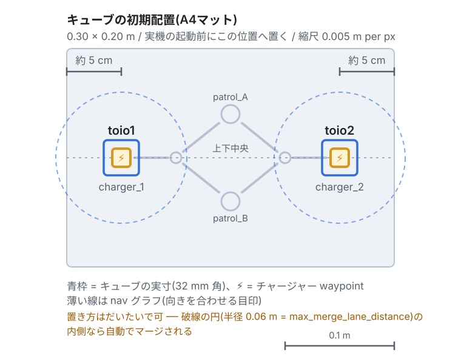
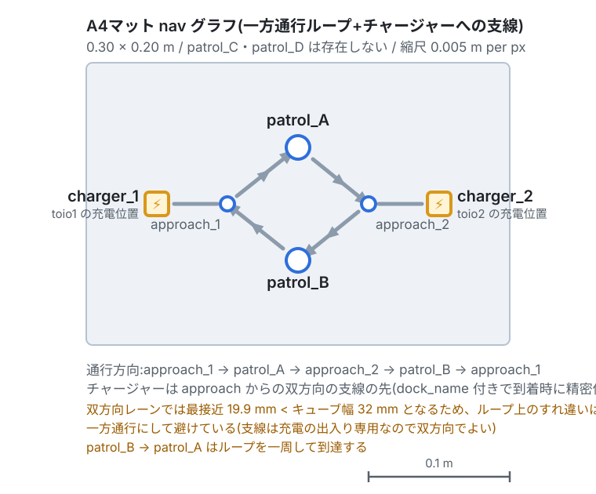

# 章11: 実機へ(sim→real の考え方と準備)

← [前章: 可視化とダッシュボード](10_visualization.md) | [目次](../README.md) | 次章: [実機で1台を動かす →](12_real_go_to_place.md)

ここから**第2部 実機編**。シミュレーションで学んだフリート処理を、**実機の
toioキューブ**でもう一度なぞる。この章はその導入で、sim と real で**何が変わり、
何が変わらないか**を押さえ、実機を起動できる状態まで持っていく。

## 狙い

- sim と real の差分を**1枚の表**で押さえる
- 実機の準備(Bluetooth・toio.py・A4マット・初期配置)を済ませる
- 実機特有の落とし穴(**起動順序**と**最初のタスク**)を知ったうえで起動する
- 以降の章で毎回使う **A4の頂点の読み替え**を手元に置く

ここまでの章はすべてこの第2部の準備だった。**タスク操作(章3〜9)は
`--use_sim_time` の有無以外そのまま通る** ── それを章12以降で1つずつ確かめる。

## 変わらないこと / 変わること

[章2](02_architecture.md)の三層モデルを思い出す。**差し替わるのは一番下の
ロボット層(③)だけ**。RMFコア(①)とフリートアダプタ(②)、つまり入札・
交通調停・充電・タスクの仕組みは**まったく同じ**。

| | シミュレーション(第1部) | 実機(第2部) |
|---|---|---|
| RMFコア・入札・交通調停・充電 | ← **同一** → | ← **同一** → |
| 起動の合図 | `run_sim:=true use_sim_time:=true` | 既定のまま(`run_sim:=false` / `use_sim_time:=false`) |
| 端末構成 | 端末A(全部)+ 端末B(タスク投入) | 端末1(実機ブリッジ)+ 端末2(RMF+Nav2)+ 端末3(タスク投入) |
| マット | A3(6頂点・双方向) | **A4**(4頂点・一方通行ループ) |
| ロボットを動かす実体 | toio_gazebo | toio_ros2 のBLEブリッジ + 実キューブ |
| 位置報告 | TF(`map`→ベースフレーム)にフォールバック | `/toioN/toio/pose` を購読 |
| バッテリ | 100%固定(`publish_battery` で疑似放電) | `/toioN/toio/battery_state`(実測・10%刻み) |
| チャージャー到着 | Nav2の結果だけで完了 | **Dockイベント**でキューブ内蔵走行が精密停止 |
| 効果音 | ログに出るだけ | 実際に鳴る |
| タスクCLIの `--use_sim_time` | 付ける | 付けない |

「位置とバッテリは③→②へ別経路で上がる」という[章2](02_architecture.md)の話が、
ここで効く。実機では TF ではなく toio_ros2 の専用トピック由来になる ──
**アダプタから上のRMFにとっては、どちらから来ても同じ「ロボットの位置」**。

> [!NOTE]
> 実機編の各章に載せている画像・動画は、**当面は第1部と同じシミュレーションの
> もの**を使い回している。画面の見え方(RVizの緑の帯、マゼンタの実位置)は
> 実機でも同じなので目安にはなるが、右側の Gazebo 画面は実機には無い。
> 実機撮影のものに差し替える予定。

## 実機の準備

環境構築で実機用の追加(`--with-toio-py` など)が要る。手順は
[docs/SETUP.md の「実機検証の手順」](https://github.com/atinfinity/toio_rmf_bringup/blob/main/docs/SETUP.md)に詳しい。ここでは要点だけ。

- Bluetoothアダプタが必要
- toio.py を venv(`~/toio_venv`)へ導入済みであること
- **A4マット**を使う(実機検証はA4前提で整備されている。第2部は全章A4)
- キューブ2台を**充電済み**にしておく(章14で残量を減らす実験をするが、
  それ以外の章は残量が十分ある状態で進める)


*toio1 は `charger_1`(左端から約5cm・上下中央)、toio2 は `charger_2`(右端から
約5cm・上下中央)へ。破線の円は自動マージ範囲(半径0.06m)で、この内側なら
だいたいの位置でよい。*

## 起動順序 ── 実機で最初に踏む落とし穴

シミュレーションは1コマンドだったが、**実機は2端末で、順序が決まっている**。

> [!WARNING]
> **実機ブリッジを先に起動すること。** 逆順にすると nav2 が恒久的に
> 起動失敗する。

理由: Nav2のcostmapは活性化時に `map → toioN/base_link` のTFを待つ。これを
供給するのは実機ブリッジ側。待ち時間が `initial_transform_timeout` を超えると
活性化がエラーになり、lifecycle managerがbringup全体を中止する。**自動リトライ
は無く**、あとからブリッジを起動しても復旧しない ── 全体を落として起動し直す
しかない(復旧手順は[章16](16_real_troubles.md))。

```bash
# 端末1: 実機ブリッジ(venv内。キューブの電源を入れてから)
source ~/toio_venv/bin/activate
ros2 launch toio_ros2 toio_multi_bringup.launch.py cube_ids:=<ID1>,<ID2>

# 端末2: RMFコア + アダプタ + Nav2(ブリッジが位置を出し始めてから)
source /opt/ros/jazzy/setup.bash
source ~/dev_ws/install/setup.bash
ros2 launch toio_rmf_bringup toio_rmf.launch.py mat:=a4

# 端末3: タスク投入(第1部の端末Bに相当)
source /opt/ros/jazzy/setup.bash
source ~/dev_ws/install/setup.bash
```

- 端末2は `run_sim` / `use_sim_time` を**指定しない**(既定が実機運用)
- RMF運用時は toio_ros2 ノードに `enable_goal_pose_motion:=false` を設定する
  (`/toioN/goal_pose` を無効化。RMFがNav2経由で動かすため)
- 「ブリッジが位置を出し始めた」は、端末3で
  `ros2 topic echo /toio1/toio/pose --once` が返ることで確かめられる

TF待ちのタイムアウトは toio_navigation の `nav2_params.yaml` で **300秒**に
設定済み(Nav2既定の60秒ではBLE接続に足りなかった)。背景は
[docs/SETUP.md](https://github.com/atinfinity/toio_rmf_bringup/blob/main/docs/SETUP.md) に詳しい。

## 最初のタスクは「25秒待って・ログで確かめて」投げる

> [!WARNING]
> **`Managed nodes are active` が出てから最初のタスクを投げるまで、約25秒
> 待つ。** 活性化直後に投げた**最初のCLI要求は消えることがある**
> ([toio_rmf_bringup#55](https://github.com/atinfinity/toio_rmf_bringup/issues/55))。
> 投げたら、フリートアダプタのログに `Direct request … queued`(指名時)か
> ディスパッチャの `Add Task`(入札時)が出たことを確認する。出ていなければ
> もう一度投げる。sim では起きにくいが、実機では毎回意識するとよい。

第2部の各章は、この「待って・確かめる」を済ませた状態から始める。

## A4の頂点の読み替え(第2部で毎回使う)

第1部のコマンド例はA3(6頂点)前提。**A4は頂点が4つだけ**なので、次の表で
読み替える。各章のコマンドはすでに読み替え済みで載せるが、第1部の確認課題を
実機でやり直すときはこの表を見る。

| A3(第1部・6頂点) | A4(第2部・4頂点) |
|---|---|
| `charger_1` / `charger_2` | `charger_1` / `charger_2`(そのまま) |
| `patrol_A` / `patrol_B` | `patrol_A` / `patrol_B`(そのまま) |
| `patrol_D` | **`patrol_B` に読み替え** |
| `patrol_C` | **A4には無い**(`patrol_A` などで代替) |


*`approach_1 → patrol_A → approach_2 → patrol_B → approach_1` の一方通行ループ。
チャージャーはループ上でなく支線の先にある。形の意味は[章6](06_traffic.md)の
実験3と、[章13](13_real_bidding_traffic.md)で改めて扱う。*

## 実機編の進め方

第1部と同じ「狙い / 動かす / 観察する / 理解する / 確認課題」の型で進むが、
**書くのは sim との差分だけ**。コマンドの意味や概念は第1部の章へリンクするので、
忘れていたらそちらへ戻る。

| # | 章 | 対応する第1部 | 実機で新しく見えるもの |
|---|---|---|---|
| 12 | [実機で1台を動かす](12_real_go_to_place.md) | 章3・4 | 位置報告の出どころ、一方通行ループの周回 |
| 13 | [実機で入札と交通調停](13_real_bidding_traffic.md) | 章5・6 | レーン数で決まる入札、mutex による直列化 |
| 14 | [実機でバッテリと自動充電](14_real_battery_charge.md) | 章7 | **実測残量で ChargeBattery が発火**、Dock精密停止 |
| 15 | [実機で搬送・アクション・可視化](15_real_delivery_action_viz.md) | 章8・9・10 | 効果音が鳴る、実機のダッシュボード |
| 16 | [実機特有のトラブルと復帰](16_real_troubles.md) | ── | BLE切断、マット境界、逆順起動からの復旧 |
| 17 | [卒業課題とまとめ](17_real_graduation.md) | ── | 実機検証チェックリスト |

まず章12で、sim で最初にやった「1台を1回動かす」を実機で繰り返す。

← [前章: 可視化とダッシュボード](10_visualization.md) | [目次](../README.md) | 次章: [実機で1台を動かす →](12_real_go_to_place.md)
