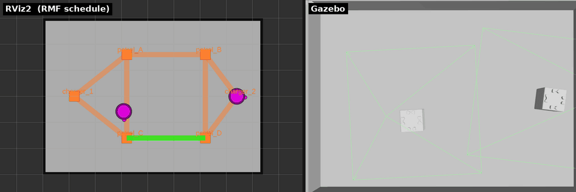

# 章12: 実機で1台を動かす(go_to_place / patrol)

← [前章: 実機へ](11_real_robot.md) | [目次](index.md) | 次章: [実機で入札と交通調停 →](13_real_bidding_traffic.md)

対応する第1部: [章3 1台を動かす](03_go_to_place.md) / [章4 巡回と帰還](04_patrol.md)

## 狙い

- sim で最初にやった「1台を1回動かす」を実機で繰り返し、**コマンドがそのまま
  通る**ことを体で確かめる
- RMFが見ている位置が **`/toioN/toio/pose` 由来**に変わったことを確認する
- A4の**一方通行ループ**を実機で一周させ、navグラフの形を手触りで覚える

## sim との違い

| | sim(章3・4) | 実機(この章) |
|---|---|---|
| コマンド | `--use_sim_time` 付き | **外す** |
| 頂点 | A3(`patrol_A`〜`patrol_D`) | A4(`patrol_A` / `patrol_B` のみ) |
| 位置の出どころ | TF `map → toio1/base_link` | `/toio1/toio/pose`(マットのPosition ID) |
| 経路の選び方 | 等長経路が2本あり毎回変わりうる | ループが1本なので**常に同じ向きに回る** |

## 動かす

[章11](11_real_robot.md)の手順で端末1・2を起動し、25秒待ってから端末3で:

```bash
# 指名して1台だけ動かす(章3の「特定の1台を指名する」)
ros2 run rmf_demos_tasks dispatch_go_to_place -p patrol_B -F toio -R toio1
```

`--use_sim_time` が無いだけで、章3と同じコマンド。投げたら端末2のログに
`Direct request … queued` が出たことを確認する(出なければもう一度)。

続けて巡回。A3の `patrol_A patrol_D` は、A4では `patrol_A patrol_B`:

```bash
ros2 run rmf_demos_tasks dispatch_patrol -p patrol_A patrol_B -n 3
```


*第1部の sim 動画を流用。左の RViz2 の見え方(緑の予約経路、マゼンタの実位置)は
実機でも同じ。右の Gazebo は実機には無く、代わりに目の前のマットでキューブが動く。*

## 観察する

### 1. 位置が `/toio1/toio/pose` から来ていることを確かめる

章3では `tf2_echo map toio1/base_link` で位置を見た。実機ではアダプタが
TF でなく toio_ros2 の pose トピックを購読している:

```bash
ros2 topic echo /toio1/toio/pose
```

走行中に値が更新され、`/fleet_states`([章2](02_architecture.md))のロボット位置と
一致する。**キューブを手で持ち上げてマットから離すと pose の更新が止まる** ──
マットのPosition IDを読んで位置を出しているため。これが[章16](16_real_troubles.md)
で扱う「マット境界で位置を失う」現象の正体。

### 2. 一方通行ループを目で追う

`patrol_A patrol_B` の3周は、A3の往復(章4)と違って**ループを同じ向きに回り
続ける**。`patrol_B → patrol_A` の復路も、来た道を戻らず `approach_1` を経由して
回り込む。RVizの緑の帯がループをなぞるのを見ながら、
[章11](11_real_robot.md)のnavグラフ図と照らす。

### 3. 完了後の帰還と、チャージャーへの最終区間

3周終わると `finishing_request` でチャージャーへ帰る(章4と同じ)。ただし
**最後の数cmはNav2でなくキューブ内蔵の走行**で停まる ── チャージャー頂点に
設定された **Dockイベント**で、これは実機だけの機能。詳しくは
[章14](14_real_battery_charge.md)で扱うので、ここでは「最後にピタッと止まる」
のを見ておく。

### 4. タスクの一生をログで追う(章3と同じ)

端末2の `rmf_task_dispatcher` と `toio_fleet_adapter` のログに、章3で読んだ
「BidNotice → BidResponse → 落札 → NavigateToPose → completed」が同じ順で流れる。
**ログの読み方は sim と1行も変わらない**ことを確認するのがこの章の肝。

## 理解する

- **差し替わったのは③だけ**。コマンドもログも sim と同じで、違うのは位置の
  出どころと、走っている実体。[章2](02_architecture.md)の三層モデルが、そのまま
  実機で成り立っている。
- **位置の出どころが変わると、失い方も変わる**。TF は Gazebo が出し続けるが、
  実機の pose はマット上にいる間しか出ない。フリート運用で「位置ロスト」が
  現実の問題になる入口がここ。
- **navグラフの形が走り方を決める**。A3では「同じ2点でも経路が変わる」
  (章4)、A4では「常に同じ向き」。交通調停のしやすさにも直結する(次章)。

## 確認課題

1. `-R toio2` に変えて `go_to_place patrol_A` を投げ、toio2だけが動くことを
   確認する。`/toio2/toio/pose` も同時に echo しておく。
2. patrol 中にキューブを**一瞬持ち上げて戻す**。`/toio1/toio/pose` が止まって
   再開するのを見る。RMFの `/fleet_states` の位置はその間どうなるか。
3. `patrol_B patrol_A` の順で投げ、往路・復路ともループを回り込むことを
   確認する。A3(章4)で同じ課題をやったときと何が違うか、説明できるか。

1台が実機で動いたら、次は2台。A4の狭さが入札と交通調停にどう効くかを見る。

← [前章: 実機へ](11_real_robot.md) | [目次](index.md) | 次章: [実機で入札と交通調停 →](13_real_bidding_traffic.md)
