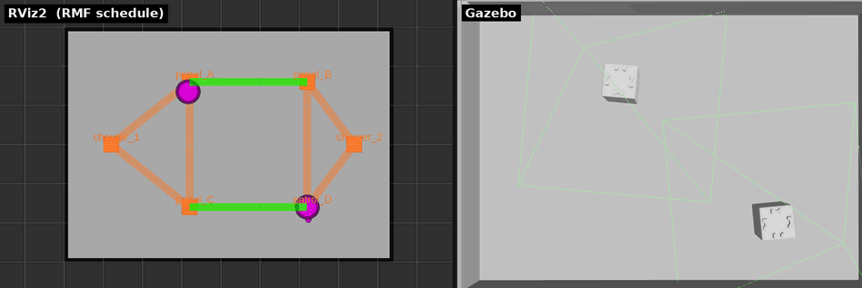

# 章13: 実機で入札と交通調停(bidding / traffic)

← [前章: 実機で1台を動かす](12_real_go_to_place.md) | [目次](index.md) | 次章: [実機でバッテリと自動充電 →](14_real_battery_charge.md)

対応する第1部: [章5 2台と入札](05_bidding.md) / [章6 交通調停](06_traffic.md)

## 狙い

- A4では入札コストが「距離」でなく**「通るレーン数」**で決まることを見る
- 狭いA4で2台を動かすと、**mutex group `ring` によってタスクが直列化される**
  ことをログで確かめる
- 実機で2台同時に投げるときの**安全な間隔**を身につける

## sim との違い

| | sim(章5・6、A3) | 実機(この章、A4) |
|---|---|---|
| 入札で効くもの | 直線距離に近い | **レーン数**(一方通行で回り込むため) |
| 章5の実験1(先に寄せて勝者を作る) | 成立する | **成立しない**(寄せた直後に帰還する) |
| 2台のすれ違い | 格子で局所回避しながら交差 | ループ上は**常に1台**(mutex で待つ) |
| 2台同時投入 | 余裕がある | **物理限界に近い**(頂点付近で角が接触しうる) |

## 動かす・観察する

### 実験1: 目的地を変えて勝者を入れ替える(章5の読み替え)

A4は一方通行ループなので、`charger_1 → patrol_A` は 1レーン、
`charger_2 → patrol_A` は 3レーン(ループを回り込む)。指名なしで投げると:

```bash
ros2 run rmf_demos_tasks dispatch_go_to_place -p patrol_A   # → toio1 が落札
# 帰還を待ってから
ros2 run rmf_demos_tasks dispatch_go_to_place -p patrol_B   # → toio2 が落札
```

端末2の `rmf_task_dispatcher` ログで、BidResponse の見積(到達時刻)が
toio1/toio2 で逆転しているのを読む。章5の「距離で勝者を作る」は、A4では
**目的地で勝者を作る**に読み替える。

> 章5の実験1(toio1を先に寄せてから近い方に落札させる)は、A4実機では
> 寄せた直後に `finishing_request` でチャージャーへ帰ってしまい成立しない。
> 上の読み替えがその代わり。

### 実験2: 指名して入札を飛ばす(章5と同じ)

```bash
ros2 run rmf_demos_tasks dispatch_patrol -p patrol_A patrol_B -n 1 -F toio -R toio2
```

入札が省かれて toio2 に直接割り当たる。ログの違いは章5の実験2と同じ。

### 実験3: 2台に続けて投げ、mutex の待ちを見る

ループ全体は mutex group `ring` になっている
([toio_rmf_maps#16](https://github.com/atinfinity/toio_rmf_maps/pull/16))。
1本目の直後に2本目を投げると:

```bash
ros2 run rmf_demos_tasks dispatch_go_to_place -p patrol_A -F toio -R toio1
# 数秒後
ros2 run rmf_demos_tasks dispatch_go_to_place -p patrol_B -F toio -R toio2
```

端末2にこう出る:

```
[toio/toio2] is waiting to lock mutex group [ring] but that mutex is currently held by [toio/toio1]
```

toio2 はチャージャーで待ち、**toio1 がチャージャーへ戻った瞬間に出発する**。
つまり A4 では**2台同時のタスクは直列化される**。章6で見た「大域スケジュールで
待つ」が、ここでは mutex という形で現れている。


*第1部の A3 での交差動画を流用。A4実機では交差は起きず、上のログのとおり
片方がチャージャーで待つ形になる。*

> mutex の調停には RMF の `mutex_group_supervisor` が要り、
> [toio_rmf_bringup#60](https://github.com/atinfinity/toio_rmf_bringup/pull/60) 以降の
> `toio_rmf.launch.py` に含まれている。無いと `Waiting to lock mutex groups` のまま
> 動かない([TROUBLESHOOTING](TROUBLESHOOTING.md))。

### 2台同時に投げるときの安全な間隔

mutex で直列化されるとはいえ、A4(0.30×0.20m)は狭い。mutex を入れる前の
実測では、8秒後に同じ頂点へ投げて接触した(最接近 27 mm、
[toio_rmf_bringup#56](https://github.com/atinfinity/toio_rmf_bringup/issues/56))。
mutex 導入後は同条件で最接近 52 mm・forfeit 0 だが、待ちを短くする意味でも:

- **2本目は1本目から30秒以上空ける**
- **1台目が向かっていない頂点**を2本目に指定する

確実な非接触が要る検証は A3(sim)、という判断は[章6](06_traffic.md)のとおり。

## 理解する

- **入札コストはnavグラフの形で決まる**。同じ「近い方が勝つ」でも、A3では
  距離、A4ではレーン数。運用者が「なぜこの1台が選ばれたか」を説明するには、
  グラフの形を知っている必要がある。
- **交通調停の手段は一つではない**。章6の大域スケジュール(予約)と局所回避に、
  ここで **mutex group**(排他区間)が加わった。狭くて逃げ道が無い場所は、
  調停で頑張るより「同時に入れない」と決めてしまう方が安全で、地図側で
  そう書ける。
- **直列化は遅いが壊れない**。フリートの効率は落ちるが、実機の接触リスクを
  地図で消している。効率と安全のトレードオフを、地図設計で選んだ例。

## 確認課題

1. `patrol_A` と `patrol_B` を指名なしで交互に投げ、勝者が toio1/toio2 で
   入れ替わることを BidResponse のログで確認する。
2. 実験3で toio2 が待っている間に `/fleet_states` を echo し、toio2 の状態
   (位置は動かず、タスクは割り当て済み)を読む。
3. 2本目を30秒空けて投げた場合と数秒後に投げた場合で、toio2 の待ち時間が
   どう変わるか比べる。mutex が無かったらどうなるか、章6の知識で説明できるか。

2台の振る舞いが見えたら、次は実機編の山場 ── **本当に減るバッテリ**で
ChargeBattery を発火させる。

← [前章: 実機で1台を動かす](12_real_go_to_place.md) | [目次](index.md) | 次章: [実機でバッテリと自動充電 →](14_real_battery_charge.md)
