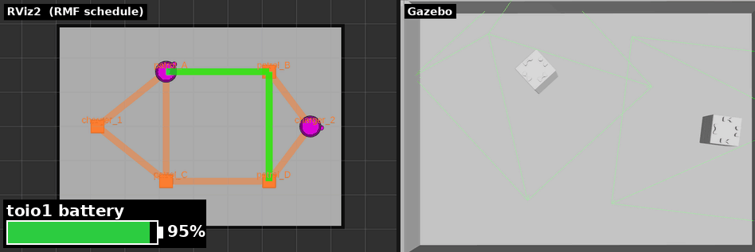

# 章14: 実機でバッテリと自動充電(ChargeBattery / Dock)

← [前章: 実機で入札と交通調停](13_real_bidding_traffic.md) | [目次](index.md) | 次章: [実機で搬送・アクション・可視化 →](15_real_delivery_action_viz.md)

対応する第1部: [章7 バッテリと自動充電](07_battery_charge.md)

## 狙い

- 実機では `battery_percent` が本当に減る(10%刻み)ことを見る
- 残量が閾値を下回り、**ChargeBattery が自動で発火してチャージャーへ帰る**ところを実機で見届ける ── 実機編の山場
- チャージャー到着の最終区間を担う **Dockイベント**を理解する
- キャンセル → 再投入 を実機でやる

この章は時間がかかる。残量を20%まで落とすには、充電済みのキューブで1時間以上の走行が要る(25分で 90% → 70% という実測からの推定)。先に章15〜17を済ませ、この章は時間のあるときに戻ってくるのでもよい。章12・13では残量が十分ある状態で進めているので、ここで初めて「減らす」。

## sim との違い

| | sim(章7) | 実機(この章) |
|---|---|---|
| `battery_percent` | 100%固定(`publish_battery:=true` で疑似放電) | `/toioN/toio/battery_state` の実測。10%刻みで離散的に下がる |
| ChargeBattery の発火 | 疑似バッテリを有効にしないと起きない | **残量が20%以下で発火**([toio_rmf_bringup#50](https://github.com/atinfinity/toio_rmf_bringup/issues/50)) |
| 減り方の目安 | `battery_discharge_rate` で自由 | 実測で25分の走行で 90% → 70% ほど |
| チャージャー到着 | Nav2の結果だけで完了 | Dockイベントでキューブ内蔵走行が精密停止 |
| `cancel_task` | `--use_sim_time` を付けない唯一のコマンド | 他と同じく付けない(差が消える) |

## 動かす・観察する

### 1. 実測の残量を見る

```bash
ros2 topic echo /toio1/toio/battery_state --once   # キューブの生の値
ros2 topic echo /fleet_states --once               # RMFが見ている battery_percent
```

両者が一致し、100% 以外の値(充電直後なら 100 か 90)が出る。これが章7の「sim では 100% 固定」の裏返し。

### 2. 残量を落とす

長い patrol を投げて放置する:

```bash
ros2 run rmf_demos_tasks dispatch_patrol -p patrol_A patrol_B -n 50 -F toio -R toio1
```

10分おきくらいに `/fleet_states` を echo し、`battery_percent` が 10%刻みで段階的に下がっていくのを記録する。アダプタのログには `The current battery percentage is 70.0% ... charging at an average rate of ...` のように、残量と消費率の推定が出る ── sim では `0.0 %/hour` だったものが、実機では意味のある数字になる。

### 3. ChargeBattery の発火を見届ける

残量が 20%以下になると、RMFは patrol の途中でも ChargeBattery を割り込ませ、ロボットは `patrol_A`/`patrol_B` を離れてチャージャーへ向かう。章7の状態遷移で言う「実行中 → 充電帰還」が、ここで初めて目に見える。

- 端末2のログに ChargeBattery のタスクが現れる(投げていないのに出る ── 「投げないタスク」の正体)
- `/fleet_states` の `mode` が CHARGING に変わり、`battery_percent` が10%刻みで上がり始める
- 充電が閾値を超えると、中断していた patrol に戻る


*第1部の `publish_battery:=true` での動画を流用。実機では左下の残量バーに相当する値が10%刻みで動く。*

### 4. Dockイベント ── 最後の数cmはキューブ自身が走る

チャージャー頂点には `dock_name` が設定されており、到着の最終区間がDockイベントになる。ここではNav2に任せず、キューブ内蔵のターゲット走行で精密に停止する(toio_fleet_adapter#3)。シミュレーションにはdockサーバが無いため、Nav2の結果だけで完了していた。

帰還時に端末2のログを見ていると、Nav2の `NavigateToPose` が完了したあとにdock の処理が走り、キューブが最後にわずかに位置を合わせて止まる。**チャージャーの上にぴったり乗らないと充電が始まらない**ので、実機ではこの精密停止が必須になる。

A4でチャージャーをループ上でなく支線の先に置いているのは、通過するだけのロボットが駐機中の相手に突っ込まないため([章11](11_real_robot.md)のnavグラフ図)。

### 5. キャンセルと再投入(章7と同じ)

```bash
ros2 run rmf_demos_tasks cancel_task -id <task_id>
```

章7と同じく、プロンプトに戻らないので `Ctrl-C` で抜けてよい。取り消したロボットは `finishing_request` でチャージャーへ帰り、Dock で止まる。そのあと再投入して普通に動けば、キャンセルの一連が実機でも通ったことになる。

> `finishing_request` や `recharge_threshold` はフリートアダプタ(RMF側)の設定。**実機では端末2(RMFコア+アダプタ)を再起動するだけで反映され、端末1の実機ブリッジは触らなくてよい**(キューブは繋ぎっぱなしでよい)。

## 理解する

- **ChargeBattery は「本物の残量」があって初めて意味を持つ**。sim では入札の見積にしか効かなかったバッテリが、実機では「いつ休むか」を本当に決める。章7の「投げないタスク」という説明が、ここで実感に変わる。
- 離散値でも RMF は困らない。10%刻みのギザギザな入力でも、閾値との比較と消費率の推定で成り立つ。センサの粗さはアダプタより上には見えない。
- Dock は「ロボット固有の得意技」を RMF に繋ぐ口。Nav2 では出せない精度を、キューブ内蔵機能に任せている。[章9](09_fleet_action.md)の perform_action と同じ発想で、「RMFは何をするかを決め、どうやるかはロボットに任せる」。

## 確認課題

1. 残量の推移を時刻付きで記録し、「10%落ちるのに何分かかったか」を出す。アダプタのログの消費率推定と合っているか。
2. ChargeBattery が発火した瞬間の `/fleet_states` と、端末2のログを保存しておく。章7の状態遷移図のどの矢印に当たるか、自分で対応づける。
3. (発展)`recharge_threshold` を上げて端末2だけ再起動し、より早くChargeBattery が発火することを確認する(確認後は戻す)。端末1を触らずに済む理由を[章2](02_architecture.md)の三層で説明できるか。

← [前章: 実機で入札と交通調停](13_real_bidding_traffic.md) | [目次](index.md) | 次章: [実機で搬送・アクション・可視化 →](15_real_delivery_action_viz.md)
