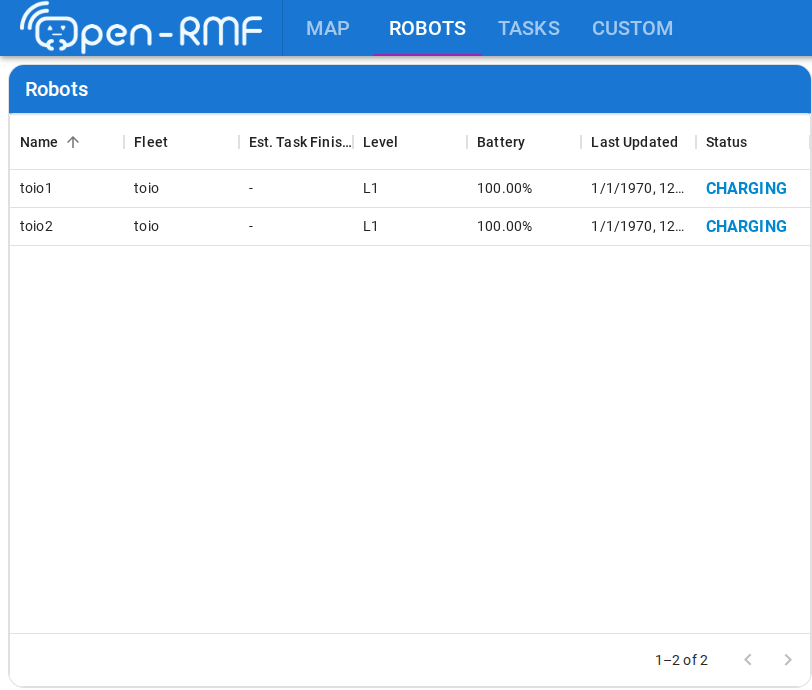

# 章15: 実機で搬送・アクション・可視化(delivery / perform_action / dashboard)

← [前章: 実機でバッテリと自動充電](14_real_battery_charge.md) | [目次](index.md) | 次章: [実機特有のトラブルと復帰 →](16_real_troubles.md)

対応する第1部: [章8 搬送とワークセル](08_delivery.md) / [章9 フリートアクション](09_fleet_action.md) / [章10 可視化とダッシュボード](10_visualization.md)

## 狙い

- delivery・perform_action・ダッシュボードは、実機でもほぼそのままであることを
  確かめる(差分が薄い3章をまとめて扱う)
- 実機で初めて**効果音が鳴る**のを聞く
- 実機のダッシュボードを `USE_SIM_TIME=false` で立てる

## sim との違い

| | sim(章8・9・10) | 実機(この章) |
|---|---|---|
| delivery のワークセル | mock(`toio_dispenser` / `toio_ingestor`) | 同じ mock。実機でも荷物は載らない |
| perform_action の LED | Gazebo 上で色づく | 本物のキューブが光る |
| perform_action の効果音 | ログに出るだけ | **鳴る** |
| RViz | 同じ | 同じ(マゼンタの実位置が pose トピック由来になるだけ) |
| ダッシュボードのコンテナ | `USE_SIM_TIME=true` | `USE_SIM_TIME=false` |
| `server_uri` 付き起動 | 端末Aを起動し直す | 端末2だけ起動し直す(端末1はそのまま) |

## 動かす・観察する

### 1. delivery(章8の読み替え)

pickup を `patrol_A`、dropoff を A3の `patrol_D` から `patrol_B` へ:

```bash
ros2 run rmf_demos_tasks dispatch_delivery -p patrol_A -ph toio_dispenser \
  -d patrol_B -dh toio_ingestor
```

`/dispenser_requests` と `/ingestor_requests` の流れは章8とまったく同じ。
ワークセルは mock なので、実機でもロボットは pickup 地点で3秒待つだけ。
「荷役はロボットでなくワークセルの仕事」という分担が、実機でも変わらない
ことを確認する。

### 2. perform_action ── LED と効果音(章9の読み替え)

```bash
ros2 run rmf_demos_tasks dispatch_action -s patrol_A -a delivery_pickup
ros2 run rmf_demos_tasks dispatch_action -s patrol_B -a delivery_dropoff
```

- 頂点に着くと本物のキューブの LED が pickup=緑 / dropoff=青 に光り、3秒保持
- 同時に効果音が鳴る。sim では `playing sound effect ...` とログに出るだけ
  だった指令が、実機では toio_ros2 経由でキューブに届く


*第1部の動画を流用。LED が緑・青に変わる部分が、実機では目の前のキューブで起きる。*

章9の YAML カスタマイズ(色・音・保持時間)は、フリートアダプタ側の設定なので
端末2だけ再起動すれば反映される。

### 3. RViz(章10と同じ)

マーカーの読み方は章10のとおり。実機で見ておきたいのは:

- **マゼンタ(実位置)が、マットの上のキューブの位置と合っているか**。
  ずれていればキューブの初期配置か、マットの向きを疑う
- 方向転換のたびにキューブが一瞬止まるので、緑の予約経路に対して実位置が
  遅れたり追いついたりする。章10で「teal/黄の円が跳ねて見える」理由として
  説明した現象が、実機ではキューブ自体の動きとして見える

### 4. rmf-web ダッシュボード(章10の読み替え)

章10の手順で、コンテナ起動時の環境変数と、起動し直す端末が変わる:

```bash
# コンテナ(実機なので USE_SIM_TIME=false)
cd ~/dev_ws/src/toio_rmf_bringup/docker
USE_SIM_TIME=false docker compose up -d

# 端末2だけ server_uri 付きで起動し直す(端末1の実機ブリッジはそのまま)
ros2 launch toio_rmf_bringup toio_rmf.launch.py mat:=a4 \
  server_uri:=ws://localhost:8000/_internal
```

<http://localhost:3000> の Robots タブで、Battery が 100% 固定でないことを
確認する ── 章10のスクリーンショットで「sim の制約」と注釈した部分が、
実機では本物の値になる。


*第1部のスクリーンショットを流用。実機では Battery 列が章14で見た実測値になる。*

## 理解する

ワークセルも perform_action も、実機でも「RMF側の話」のまま。ロボット層③を差し替えても
dispenser / ingestor との会話や perform_action の流れは一切変わらず、**変わるのは
LED指令・効果音指令の行き先が本物になることだけ**。もう一つ、この章で3回出てきた
「端末2だけ再起動」を意識しておく。RMF側の設定変更は端末2だけ、キューブ側
(BLE接続)は端末1だけ ── これを分けて考えられると、実機のデバッグが速くなる。

## 確認課題

1. delivery を投げ、`/dispenser_requests` が pickup 到達時に飛ぶのを echo で
   確認する。章8と出力が同じであることを見る。
2. perform_action の効果音IDを YAML で変え、端末2だけ再起動して音が変わる
   ことを確認する(確認後は戻す)。

機能は一通り実機で通った。残るのは、sim には無かった実機だけのトラブル。

← [前章: 実機でバッテリと自動充電](14_real_battery_charge.md) | [目次](index.md) | 次章: [実機特有のトラブルと復帰 →](16_real_troubles.md)
